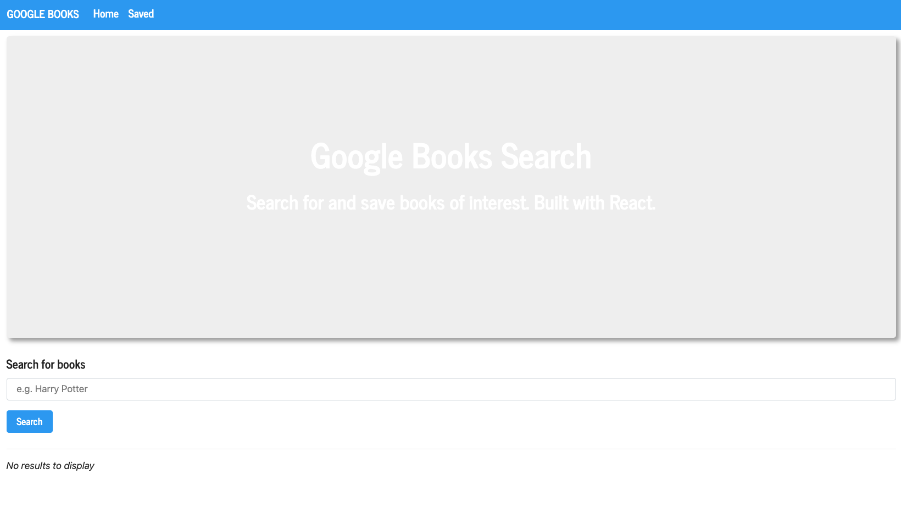

# Google-Books-React-Search

# User Story

This is an application created using MERN stack. It allows users to search for books via the Google Books API. The search results will be dynamically rendered in the UI and users will have the option to save and/or delete books. My main motivation for this project is to create an application that will allow users to manage their Google Boks search and have the ability to save and/or delete books.

# Installation

In order to use this app, you will need to use:

- React JS
- MongoDB
- Mongoose
- Express JS
- Node
- Axios

# Preview of the App

# License

MIT
